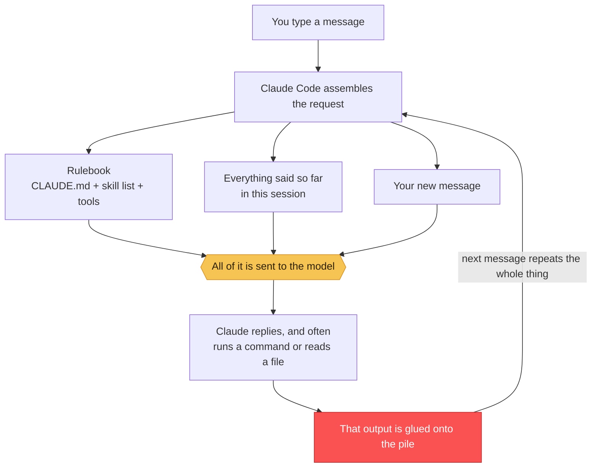
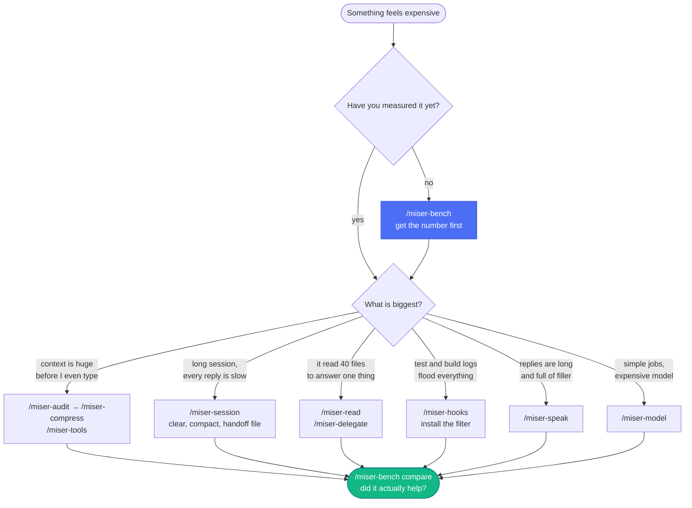
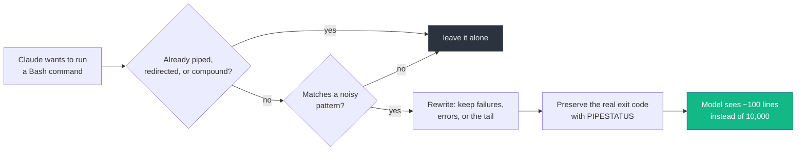
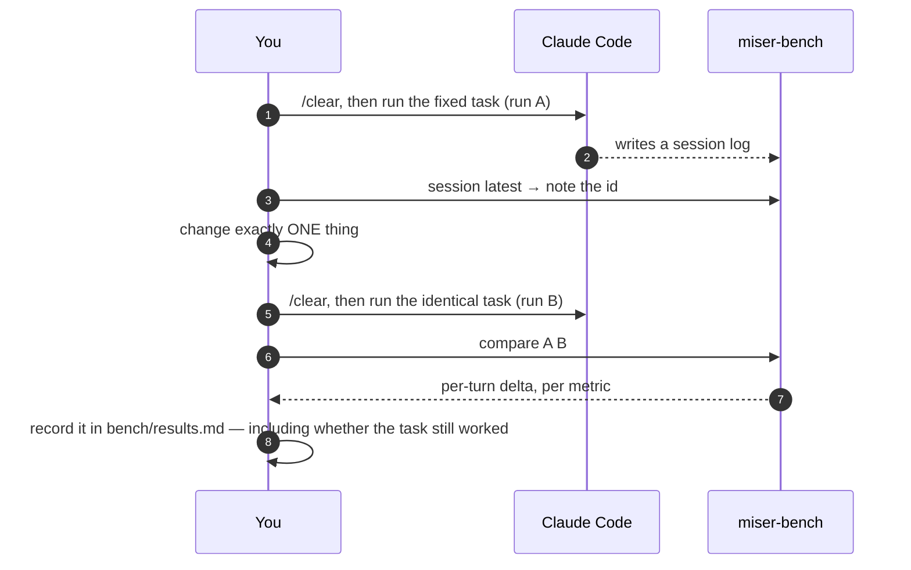

<p align="center">
  
</p>

<p align="center">
  <a href="#install"></a>
  
  
  
</p>

---

## Start here: what is this thing?

Claude Code is an assistant that lives in your terminal and writes code with you. It is not free — every message costs **tokens**, and tokens cost money (or eat the usage that came with your plan).

**tokenmiser is a set of 15 small instruction files that teach Claude Code to use fewer tokens for the same work**, plus two scripts that prove whether it actually worked.

That's it. No service to sign up for. Nothing runs in the background. Nothing phones home.

```bash
npx @srinivasan-78/tokenmiser@latest install
```

---

## The one idea you need to understand

Here is the surprising part, and everything else follows from it:

> **Claude has no memory.** Every time you send a message, the entire conversation so far is sent again, from the beginning.

Think of a friend who forgets everything the moment you stop talking. To ask them a follow-up question, you first have to re-read them the whole conversation out loud. Every single time.

That re-reading is what you pay for.

<p align="center">
  
</p>

So message #40 in a long session can cost **fifteen times** what message #1 cost — even if you only typed *"yes, do that"*.

This leads straight to the rule the whole toolkit is built on:

> **The size of the pile matters far more than the length of your question or Claude's answer.**

Most advice about "saving tokens" tells you to ask Claude to be brief. That helps a little — the reply is usually under 10% of the bill. tokenmiser goes after the other 90%.

---

## What is actually in the pile?

Four things ride along on every request. Here is roughly how a real, long session divides up:

<p align="center">
  
</p>

| Bucket | What it is | Plain-English version |
|---|---|---|
| **Always-on context** | `CLAUDE.md`, the list of every installed skill, tool schemas, memory files | The rulebook Claude re-reads before every job |
| **Conversation history** | Every earlier message, yours and Claude's | The pile from the picture above |
| **Tool results** | Files it opened, test output, build logs, `grep` results | Everything Claude looked at while working |
| **The reply** | The answer it writes, plus its thinking | The only part most people try to shrink |

Each tokenmiser skill grabs exactly one of these and squeezes it.

---

## How a single turn really works

Read this once and the rest of the README explains itself.



The red box is the trap. A single `npm test` that prints 10,000 lines does not cost you once — it is re-sent with **every message for the rest of the session**.

That one insight is worth more than every other trick here combined, and it is why the filter hook (below) is usually the biggest single win.

---

## Install

### The quick way (recommended)

```bash
npx @srinivasan-78/tokenmiser@latest install
```

> **Note the `@srinivasan-78/` scope.** The bare name `tokenmiser` on npm belongs to an
> unrelated package by another author, so `npx tokenmiser@latest install` downloads *that*
> package and fails — it has no `install` command. This project publishes under the scope above.
>
> The same installer also runs straight from GitHub, no npm publish involved:
>
> ```bash
> npx github:Srinivasan-78/tokenmiser install
> ```
>
> Typing either repeatedly gets old, so set an alias once:
>
> ```bash
> alias tokenmiser='npx -y @srinivasan-78/tokenmiser@latest'   # add to ~/.bashrc or ~/.zshrc
> ```
>
> Every `tokenmiser <command>` below assumes that alias, or a git checkout (see further down).

You will see exactly what it plans to write, and it asks before writing anything.

```
tokenmiser install
  source   /home/you/.npm/_npx/…/tokenmiser
  target   /home/you/.claude/skills  (user scope)
  mode     copy (auto)

  install  miser-api
  install  miser-audit
  …
Write 15 skills? [y/N]
```

Restart Claude Code, then type `/miser-help`.

### All the installer options

| Command | What it does |
|---|---|
| `tokenmiser install` | All 15 skills into `~/.claude/skills` (every project on this machine) |
| `tokenmiser install --project` | Into `./.claude/skills` instead, so it can be committed with the repo |
| `tokenmiser install --hook` | Also installs the tool-output filter and wires it into `settings.json` (backing it up first) |
| `tokenmiser install --only audit,bench,speak` | Just the skills you name — the prefix is optional |
| `tokenmiser install --dry-run` | Prints the plan, writes nothing |
| `tokenmiser install --copy` / `--link` | Force copying or symlinking (default picks for you) |
| `tokenmiser status` | What is installed, where, and what it costs you per session |
| `tokenmiser doctor` | Checks Node, Python, config paths, session logs |
| `tokenmiser uninstall` | Removes every `miser-*` skill it installed |
| `tokenmiser audit` / `report` | Runs the measurement scripts without setting anything up |

> **Copy or symlink?** Run from a git checkout, it symlinks, so `git pull` updates your skills instantly. Run through `npx`, it copies — because npx unpacks into a temp folder that gets deleted, and a symlink into a deleted folder is a broken skill.

### As a Claude Code plugin

```
/plugin marketplace add Srinivasan-78/tokenmiser
/plugin install tokenmiser@tokenmiser
```

### From a checkout, without Node

```bash
git clone https://github.com/Srinivasan-78/tokenmiser
cd tokenmiser
./install.sh --hook
export MISER="$PWD"      # add to ~/.bashrc — the skills call scripts from here
```

---

## The 15 skills

Each one is a Markdown file of instructions. Claude only reads the full file when you invoke it — until then it costs about 100 tokens of "here is what I can do".

| Skill | The lever it pulls | Run it when |
|---|---|---|
| `/miser-help` | index | you forget what any of this does |
| `/miser-setup` | installs the always-on savings | first time, or on a new machine |
| `/miser-audit` | finds what is fat | "why is my context so big?" |
| `/miser-bench` | measures | before and after every change |
| `/miser-speak` | shorter replies | always on; terse mode with levels |
| `/miser-compress` | shrinks `CLAUDE.md` and memory files | your rulebook has grown past 200 lines |
| `/miser-session` | history size | `/clear` vs `/compact`, handoff files, cache misses |
| `/miser-read` | file reads | exploring a codebase you don't know |
| `/miser-tools` | tool schemas | MCP servers are eating the window |
| `/miser-delegate` | subagents | wide searches, verbose output |
| `/miser-model` | model + thinking budget | you are paying Opus prices for renaming a variable |
| `/miser-prompt` | how you ask | your requests keep triggering repo-wide scans |
| `/miser-hooks` | filtering before context | logs, tests and builds are noisy |
| `/miser-git` | commits and reviews | writing a commit message or reviewing a diff |
| `/miser-api` | your own code | you are building an agent or pipeline yourself |

The full catalogue of techniques, with sources and the numbers each one reported, is in [`reference/techniques.md`](reference/techniques.md).

---

## Which one do I use right now?



**Never skip the green box.** A change that feels lighter and isn't is worse than no change, because you'll keep it.

---

## Measure first, always

Two scripts. Neither one sends anything anywhere — they read the session logs Claude Code already writes to `~/.claude/projects/`.

### What loads before you type a single word

```bash
tokenmiser audit              # or: bash scripts/context-report.sh
```

```
=== always-on context (estimate, chars/4) ===
  tokens  source                                        note
    8149  82 skills advertised                          ~99 tokens each — delete the ones you never fire
    2310  ~/.claude/CLAUDE.md                           412 lines — OVER the 200-line guideline; run /miser-compress
     659  ~/.claude/settings.json

   11118  ESTIMATED ALWAYS-ON TOKENS
```

You pay that number at the start of every session, forever, whether you use any of it or not.

### What your sessions actually cost

```bash
tokenmiser report --since 7d
```

```
session                                   total  in(eff)  cacheRd  cacheWr     out   think turns   /turn
myrepo/d156d19a                         147.44M  147.11M  146.41M   698.6k  327.0k   98.1k   388  380.0k
myrepo/c0c0c72a                          40.33M   40.14M   39.80M   339.9k  189.1k   41.4k   168  240.1k
--------------------------------------------------------------------------------------------------------
TOTAL (54 sessions)                     417.78M  415.63M  408.14M    7.48M   2.15M  641.9k  2381  175.5k

cache read share: 98.2%
output/turn: 904  |  thinking share of output: 29.8%
eff input/turn: 174,561  <- primary knob: context size per turn
```

### The four numbers that matter

| Number | In plain words | Where you want it |
|---|---|---|
| **eff input/turn** | how big the pile is on an average message | as low as the work allows — this is *the* number |
| **cache read share** | how much of the pile was cheap because it hadn't changed | above 90%; below 80% means you keep breaking the cache |
| **output/turn** | how much Claude writes back | lower after `/miser-speak` |
| **thinking share** | how much of the reply was silent reasoning | under ~35% for routine work |

Totals are **not** a score. A hard task honestly costs more. Compare *per-turn* numbers, or the same task run twice.

> Usage records are deduplicated by request id, because Claude Code writes several log lines per reply. Tools that skip this step report sessions 2–3× larger than they are.

---

## The biggest single win: the filter hook

A hook is a small program that runs **before** a command's output reaches Claude. Whatever it removes is never paid for — not now, and not on any later turn.

<p align="center">
  
</p>

```bash
tokenmiser install --hook
```

What it rewrites, and what it refuses to touch:



- **Test runners** keep failures plus five lines of context. **Builds** keep errors. **Installers** keep the tail. **Linters** keep findings. **`git log`** gets `--oneline | head -30`. **`git diff`** and **`git show`** are capped. Unbounded **`find`** is capped.
- Anything already piped, redirected, or joined with `&&` is left completely alone — appending a pipe there would change what actually runs.
- Filtered commands end with `exit ${PIPESTATUS[0]}` and a one-line `[tokenmiser] exit=N` marker, **so a hidden failure can never read as a pass.**

Add your own rules without touching the script — `~/.claude/tokenmiser-filter.json`:

```json
{ "rules": [["^my-test-runner\\b", "{cmd} 2>&1 | tail -40"]] }
```

Turn it off for one shell with `TOKENMISER_FILTER_OFF=1`. Check it yourself any time:

```bash
python3 ~/.claude/hooks/filter-tool-output.py --selftest
```

---

## Proving a change actually helped

Feelings are not evidence. Session logs are.



```bash
node scripts/miser-bench.mjs compare 1f2c3d4a 9ab8c7d6
```

```
total          1.55M ->    0.98M  -36.8%  B cheaper
effInput       1.51M ->    0.95M  -37.1%  B cheaper
output          42.0k ->   39.1k   -6.9%  B cheaper
perTurn         58.6k ->   37.7k  -35.7%  B cheaper
```

The rules that keep this honest:

1. **One variable per run.** Two changes at once teaches you nothing.
2. **Fresh session each side.** Leftover history swamps the effect you're measuring.
3. **Same prompt, same commit.** Use `git stash` or a scratch worktree.
4. **Record failures.** A change that saves 30% and gets the answer wrong is a loss, not a win. Write it in [`bench/results.md`](bench/results.md) either way.

---

## What is in this repo

```
tokenmiser/
├── bin/tokenmiser.mjs          the npx installer — install, status, doctor, uninstall
├── skills/miser-*/SKILL.md     the 15 skills; each is instructions for Claude, nothing more
├── scripts/
│   ├── context-report.sh       what loads before you type (--json for scripts)
│   ├── miser-bench.mjs         token accounting from session logs
│   └── rates.json              optional USD prices, so reports show dollars
├── hooks/filter-tool-output.py the PreToolUse filter (has a --selftest)
├── reference/techniques.md     40 techniques, with sources and reported numbers
├── bench/results.md            your own A/B log
└── test/smoke.test.mjs         20 tests, no network, no dependencies
```

Run the tests with `npm test`.

---

## Honest limits

- **Token counts are estimates in two places.** `context-report.sh` uses characters ÷ 4; the real tokenizer differs. `miser-bench` reads the exact usage the API reported, so trust it far more. Cross-check in-session with `/context` and `/usage`.
- **Dollar amounts need prices.** `scripts/rates.json` ships empty on purpose, because prices change. Fill it in, or point `$TOKENMISER_RATES` at a file outside git.
- **The toolkit is not free either.** Every installed skill advertises ~100 tokens of name and description in every session — about 1.5k for all 15. `tokenmiser status` prints your figure. Delete the ones you never fire; `reference/techniques.md` still reads fine on its own.
- **Nothing here makes a wrong answer cheaper.** A model that fails twice at half price costs more than one that succeeds once. Every skill in here is written to hold quality flat; if a change breaks the work, it is a loss, and `bench/results.md` has a column for saying so.

---

## Uninstall

```bash
tokenmiser uninstall                        # removes every miser-* skill
rm -rf ~/.claude/tokenmiser                 # scripts, if you installed by copy
rm ~/.claude/hooks/filter-tool-output.py    # the filter, if you installed it
# then delete the PreToolUse entry from ~/.claude/settings.json
```

Nothing else was ever written.

---

## FAQ

**Do I need to keep the repo around after installing?**
Only if you installed with symlinks (the default from a git checkout), or you want the `scripts/` and `reference/` files. `tokenmiser install` copies the skills, so they stand alone.

**Does this send my code anywhere?**
No. Every script reads local files only. There is no network call in this repository.

**Will my answers get worse?**
That is what `bench/results.md` is for. The skills are written to cut *waste* — filler prose, re-read files, log spam — not detail. `/miser-speak` deliberately switches back to full prose for warnings, irreversible actions, and anything written into a file or a ticket.

**Is this related to caveman mode?**
Yes — the output-compression half started there. `/miser-speak` is that mode with levels and guard-rails, `/miser-compress` is its memory compression, and `/miser-git` its commit and review style. The other eleven skills attack the input side, which is where most of the tokens live.

**Where do the numbers in `reference/techniques.md` come from?**
Published articles, vendor docs, and papers, all linked at the bottom of that file. They are *reported* figures from other people's setups — treat them as a reason to test something, never as a promise.

---

## Contributing

Useful contributions, in order:

1. **A filled-in row in `bench/results.md`** — a real measurement beats a new idea.
2. A rule for `hooks/filter-tool-output.py` covering a noisy tool, plus a case in its `CASES` list.
3. A technique missing from `reference/techniques.md`, with a source.

`npm test` must pass. Keep skill files short: every line is re-read forever.

## License

MIT — see [LICENSE](LICENSE).
